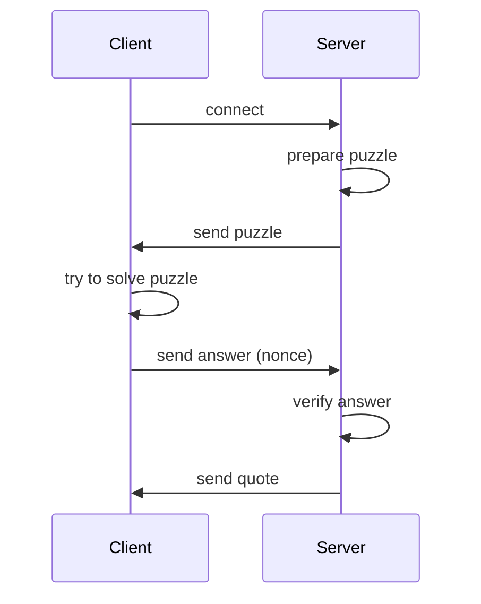

# Description
Design and implement “Word of Wisdom” tcp server.
- TCP server should be protected from DDOS attacks with the Proof of Work (https://en.wikipedia.org/wiki/Proof_of_work), the challenge-response protocol should be used.
- The choice of the POW algorithm should be explained.
- After Proof Of Work verification, server should send one of the quotes from “word of wisdom” book or any other collection of the quotes.
- Docker file should be provided both for the server and for the server and for the client that solves the POW challenge

# Working Principle
1. The client connects to the server.
2. The server generates a challenge.
3. The client receives and solves the challenge.
4. The client sends the solution to the server.
5. If the solution is correct, the server sends a quote.
6. The connection is closed.

# How To
## 1. Build
Run the following command:

    make build

This will create two binaries:
- `./bin/client`
- `./bin/server`

## 2. Run Server
The server has several configurable options set via environment variables:

- `PORT` - Default: `8080`.
- `DIFFICULTY` - Challenge difficulty (for hashes, the number of leading zeros).
- `SIZE` - Size of the challenge message (in bytes).
- `ALGO` - Algorithm type (0 - SHA1, 1 - SHA256, 2 - MD5).

## 3. Run Client
The client has a `-s` flag to specify the server address (default is `0.0.0.0:8080`).

# Protocol Description
## Algorithm Choice
Hashcash, based on the SHA-256 cryptographic hash function, is an optimal choice for implementing the Proof of Work (POW) mechanism for several reasons:

### Proven Security and Simplicity
SHA-256 is a well-established cryptographic hash function widely used in security-critical applications, including Bitcoin and TLS certificates. Its collision resistance and irreversibility ensure that the POW challenge is secure and cannot be bypassed.

### Adjustable Complexity
Hashcash allows easy adjustment of the computational difficulty by modifying the number of leading zeros required in the hash. This ensures that the challenge can be fine-tuned to balance security and usability, effectively deterring DDOS attacks by making resource consumption prohibitive for attackers.

### Client-Side Feasibility
The computational requirements for solving Hashcash challenges are modest for legitimate clients with standard hardware. This ensures that the challenge remains solvable for genuine users while imposing a significant cost on attackers attempting to overwhelm the server with requests.

### Resource Efficiency on the Server Side
Verifying the Hashcash solution is computationally inexpensive for the server. Once the client submits a hash that meets the difficulty requirements, the server only needs a single hash computation to validate it, minimizing server resource usage during high traffic.

### Widespread Support and Compatibility
The SHA-256 algorithm is natively supported in most programming languages and libraries, ensuring cross-platform compatibility and simplifying implementation in both server and client components.

### Resistance to Automation
The cryptographic properties of SHA-256 make it resistant to shortcuts or optimizations, ensuring that an attacker must expend genuine computational effort to solve the POW challenge.

## Sequence Diagram

## Packet structure
The data exchanged between the client and the server has the following structure:

### Puzzle packet
| Byte    |   Description                 | Datatype | Example |
|---------|----------------------------|------------|------------------|
| 1       | Algoritm type              | `uint8`    | `0x01`          |
| 2       | Size of puzzle | `uint8`    | `0x05` (5 bytes) |
| 3       | Difficulty   | `uint8`    | `0x05` (5 leading zeroes) |
| 3–N     | Puzzle        | `[]byte`   | `Hello`         |
